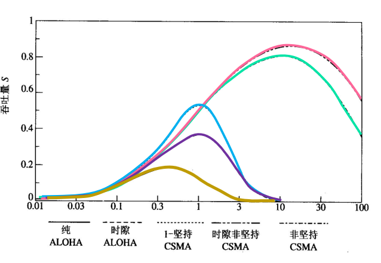
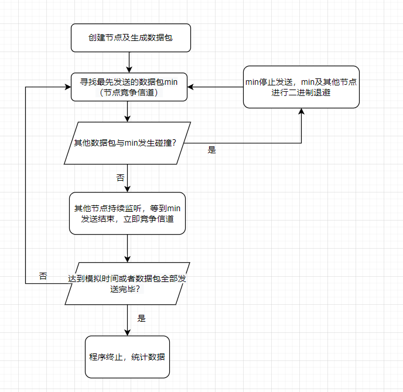

# 多址技术

当多个用户同时访问同一资源（如共享的通信链路）时，就可能会产生信息碰撞，导致通信失败。所谓多址接入协议就是在一个网络中，解决多个用户如何高效共享物理链路资源的技术。

多址技术是在数据链路层上实现的，位于数据链路层的MAC子层中。MAC子层位于数据链路逻辑控制子层LLC下，物理层之上。


多址协议分为固定多址接入协议，随机多址接入协议，预约多址接入协议三种。

## 固定多址接入协议

固定多址接入协议又称为无竞争的多址接入协议。固定多址协议为每个用户固定分配一定的系统资源，用户发送数据时能不受干扰地独享已分配的信道资源。

常见的有频分多址接入（FDMA）和时分多址接入（TDMA）。

通过分析FDMA和TDMA的时延，我们可以得出结论：传统的固定多址接入协议不能有效地处理用户数量的可变性和通信业务的突发性。

## 随机多址接入协议

随机多址协议又叫做有竞争的多址接入协议。可细分为完全随机多址接入协议（ALOHA）和基于载波侦听的多址接入协议（CSMA）。

### ALOHA协议  

ALOHA协议有纯ALOHA和时隙ALOHA协议两种。

纯ALOHA基本思想是：只要有新的分组到达，就立即被发送并期望不与别的分组发生碰撞，一旦发生碰撞，则随机退避一段时间后进行重传。  

时隙ALOHA系统将时间轴划分为若干个时隙，所有节点同步，各节点只能在时隙的开始时刻才能够发送分组，时隙宽度等于一个分组的传输时间。  

缺点：纯ALOHA和时隙ALOHA的通过率都不高，主要原因是，各站点在发送数据时从不考虑其它站点是否已经在发送数据，引起大量冲突，导致传输效率下降。  

### 载波侦听型多址（CSMA）协议  

基本思想：如果一个节点有分组要传输，它首先检测信道是否空闲，如果信道有其他分组在传输，则该节点可以等到信道空闲后再传输。  

可细分为：非坚持型CSMA ，1-坚持型CSMA ，p-坚持型CSMA 。他们在分组到达时，若信道空闲，都立即发送分组； 若信道处于忙状态 ，则有不同的操作：

​	非坚持型CSMA分组的发送将被延迟，且节点不再跟踪信道的状态 。

​	1-坚持型CSMA一直坚持检测信道状态，直至检测到信道空闲后， 立即发送该分组。  

​	p-坚持型CSMA节点一直检测信道的状态，在检测到信道空闲后，以概率p发送该分组。

同样的类似于时隙ALOHA协议，时隙CSMA协议把时间轴分成时隙，如果分组到达一个空闲的时隙，它将在下一个空闲时隙开始传输 。此外，还有CSMA/CD ，CSMA/CA两种具有碰撞避免功能的协议。

### CSMA协议性能分析



从上图可以看出：

非坚持型CSMA协议可以大大减少碰撞的机会，使系统的最大吞吐量达到信道容量的80％以上 。

时隙非坚持型CSMA协议的性能更好。  

1－坚持型CSMA由于毫无退避措施，在业务量很小时，数据的发送机会较多，响应也较快。但若节点数增大或总的业务量增加时，碰撞的机会急剧增加，系统的吞吐量特性急剧变坏  。

# CSMA模拟

编程模拟了1－坚持型CSMA协议。Simulates a LAN to show the efficiency and throughput (in Mbps) of the persistent protocol. 

程序模拟了多个节点同时抢占一条数据链路（LAN）传输的情况，考虑到物理延时及数据传输延时。节点之间间隔20km，数字信号在总线上的传输速度为2C/3(C为光速)，LAN的速度为10^6bit/s，每个数据包大小1500bit。


## 程序流程图




## 基本参数及函数说明

语言：python

class Node：节点类，包含数据包队列创建（generate_queue），二进制退避（collision_occured）等方法以及位置坐标（location），碰撞次数（collisions）等属性。

generate_queue方法模拟包到达时，根据输入的参数A作为到达率来生成包到达的Poisson过程（包到达间隔相互独立且服从参数为A的指数分布）。

csma函数为模拟的总控制函数，每次模拟时间为100s。


## 模拟结果

指标说明：

节点数：系统中竞争的节点个数

到达率：包平均到达数量（每秒）

数据包数：所有节点要传输的数据包总数

成功率：成功传输的数据包数/尝试传输次数

吞吐量：数据传输时间/总模拟时间

Number of nodes connected to the LAN = 20, 40, 60, 80, and 100

Average packet arrival rate = 7, 10, and 20 packets/second

Speed of the LAN/channel = 1 Mbps

Packet length = 1500 bits

例如这样一个输出：

```
Result of    
Nodes:  40 Avg Packet:  8
All packets:  31569
successfuly_transmitted_packets: 29651 transmitted_packets : 95178
Effeciency 0.3115320767404232
Throughput 0.444765

```

节点数：40

到达率：8

数据包数：31569

成功率：29651/95178=0.3115320767404232	（Effeciency）

吞吐量：$29651*\frac{1500}{10^6}\div{100}=0.444765$	(Throughput)	(总模拟时间为100s，数据包大小1500bit，传输速度10^6。)
$$
\begin{array}{cc|ccc}
	       节点数&到达率&数据包数&成功率&吞吐量\\
	\hline 40&8&31569&0.311&0.444\\
	       40&15&60172&0.420&0.734\\
	       40&25&99552&0.436&0.766\\
	       60&8&47833&0.297&0.577\\
	       60&15&90505&0.318&0.634\\
	       60&25&149977&0.317&0.635\\
	       80&8&63993&0.235&0.517\\
	       80&15&119679&0.240&0.529\\
	       80&25&200029&0.238&0.523\\
	       100&8&80262&0.178&0.423\\
	       100&15&150318&0.179&0.429\\
	       100&25&250954&0.177&0.423\\
	       120&8&96159&0.135&0.350\\
	       120&15&180527&0.134&0.345\\
	       120&25&300578&0.134&0.346\\
	       140&8&111960&0.102&0.284\\
	       140&15&210035&0.102&0.286\\
	       140&25&350732&0.100&0.279\\
\end{array}
$$
分析上面数据，

当系统负担轻时，增加数据包的达到率和节点数,系统的吞吐量增加。

当系统负担重时，随着数据包和节点的增多，系统碰撞现象严重，吞吐量下降较快。


# 总结

该模拟有很多可拓展的地方，比如加入对非坚持型CSMA和ｐ坚持型CSMA的模拟，调用matlab将数据可视化等，若能完成则可取得更佳的效果。

# 附录

```python
# CSMA Algorithm
import random
import math
import collections
import sys
maxSimulationTime = 100
total_num = 0


class Node:
    def __init__(self, location, A):
        self.queue = collections.deque(self.generate_queue(A))
        self.location = location  # 位置
        self.collisions = 0
        self.wait_collisions = 0
        self.MAX_COLLISIONS = 10

    def collision_occured(self, R):
        self.collisions += 1
        if self.collisions > self.MAX_COLLISIONS:
            # 达到最大退避
            self.pop_packet()
            self.collisions = 0

        # 退避时间设置
        backoff_time = self.queue[0] + self.exponential_backoff_time(R, self.collisions)

        for i in range(len(self.queue)):
            if backoff_time >= self.queue[i]:
                self.queue[i] = backoff_time
            else:
                break

    def successful_transmission(self):
        self.collisions = 0
        self.wait_collisions = 0

    def generate_queue(self, A):
        packets = []
        arrival_time_sum = 0

        while arrival_time_sum <= maxSimulationTime:
            arrival_time_sum += get_exponential_random_variable(A)
            packets.append(arrival_time_sum)
        return sorted(packets)

    def exponential_backoff_time(self, R, general_collisions):
        rand_num = random.random() * (pow(2, general_collisions) - 1)
        return rand_num * 1024/float(R)  # 1024 bit-times
        # return random.expovariate(general_collisions*3)

    def pop_packet(self):
        self.queue.popleft()
        self.collisions = 0
        self.wait_collisions = 0


def get_exponential_random_variable(param):
    # Get random value between 0 (exclusive) and 1 (inclusive)

    # random.expovariate(0.2)
    # uniform_random_value = 1 - random.uniform(0, 1)
    # exponential_random_value = (-math.log(1 - uniform_random_value) / float(param))

    return random.expovariate(param)

def build_nodes(N, A, D):
    nodes = []
    for i in range(0, N):
        nodes.append(Node(i*D, A))
    return nodes

def csma(N, A, R, L, D, S, is_persistent):
    curr_time = 0
    transmitted_packets = 0
    successfuly_transmitted_packets = 0
    allPackets = 0
    nodes = build_nodes(N, A, D)
    for node in nodes:
        if len(node.queue) > 0:
            allPackets += len(node.queue)
    min_node = Node(None, A)  # 最低结点
    min_node.queue = [float("infinity")]
    succFlag=True


    while True:

    # Step 1: 找到最先发送数据节点
        for node in nodes:
            if len(node.queue) > 0:
                min_node = min_node if min_node.queue[0] < node.queue[0] else node  #找到最近的queue
                # print(node.queue)
        # print("mini node",min_node.queue[0],min_node.queue[1],min_node.queue[2],min_node.queue[3])
        # if len(min_node.queue) >= 4:
        #     print("mini node location and queue", min_node.location,min_node.queue[0], min_node.queue[1], min_node.queue[2], min_node.queue[3])
        # else:
        #     for i in range(len(min_node.queue)):
        #         strOut = ""
        #         for i in range(len(min_node.queue)):
        #             strOut += (str(min_node.queue[i]) + ",")
        #     print("mini node location and queue",min_node.location, strOut)

        if min_node.location is None:  # 当全部传完后，终止。
            break
        dtTime= min_node.queue[0]-curr_time
        if  dtTime<L/float(R)and succFlag==True:
            print("delta time ", dtTime)
        curr_time = min_node.queue[0]
        transmitted_packets += 1

        # Step 2: 查看是否碰撞
        # 处理其他节点碰撞
        collsion_occurred_once = False
        for node in nodes:
            t_trans = L / float(R)
            if node.location != min_node.location and len(node.queue) > 0:
                delta_location = abs(min_node.location - node.location)
                t_prop = delta_location / float(S)

                # Check collision，未侦听到，发生碰撞
                if node.queue[0] <= (curr_time + t_prop):
                    will_collide = True
                else:
                    will_collide = False

                # Sense bus busy，侦听到了，等待信道
                if (curr_time + t_prop) < node.queue[0] < (curr_time + t_prop + t_trans):
                    if is_persistent is True:
                        for i in range(len(node.queue)):
                            if (curr_time + t_prop) < node.queue[i] < (curr_time + t_prop + t_trans):
                                node.queue[i] = (curr_time + t_prop + t_trans)#持续侦听到信道闲，然后发送
                            else:
                                break

                if will_collide:
                    collsion_occurred_once = True
                    transmitted_packets += 1
                    node.collision_occured(R)
            else:#避免自己的碰撞
                for i in range(1,len(node.queue)):
                    if node.queue[i] < (curr_time + t_trans):
                        node.queue[i] = (curr_time + t_trans)  # 持续侦听到信道闲，然后发送
                    else:
                        break
        # Step 3: min节点发送或碰撞
        if collsion_occurred_once is not True:  # 无碰撞
            successfuly_transmitted_packets += 1
            succFlag=True
            min_node.pop_packet()
            # if len(min_node.queue)>=4:
            #     print(curr_time,"mini pop ok location and queue",min_node.location,min_node.queue[0],min_node.queue[1],min_node.queue[2],min_node.queue[3])
            # else:
            #     strOut=""
            #     for i in range(len(min_node.queue)):
            #         strOut+=(str(min_node.queue[i])+",")
            #     print("mini pop ok location and queue",min_node.location,strOut)
        else:    # 有碰撞
            min_node.collision_occured(R)   #立即停止
            succFlag=False

        if curr_time>=maxSimulationTime:
            break
    print("Result of    ")
    print("Persistent: ", is_persistent,"Nodes: ", N, "Avg Packet: ", A)
    print("All packets: ", allPackets)
    print("successfuly_transmitted_packets:", successfuly_transmitted_packets, "transmitted_packets :",transmitted_packets)
    print("Effeciency", successfuly_transmitted_packets/float(transmitted_packets))
    print("Throughput", (L * successfuly_transmitted_packets/R) / float(maxSimulationTime))
    print("")


# Run Algorithm
# N = The number of nodes/computers connected to the LAN
# A = Average packet arrival rate (packets per second)
# R = The speed of the LAN/channel/bus (in bps)
# L = Packet length (in bits)
# D = Distance between adjacent nodes on the bus/channel
# S = Propagation speed (meters/sec)

f = open('output.txt', 'a')

sys.stdout = f
sys.stderr = f

D = 20000
C = 3 * pow(10, 8) # 光速
S = (2/float(3)) * C    #数字信号在总线上的传输速度为2C/3(C为光速)

# Show the efficiency and throughput of the LAN (in Mbps) 
for N in range(40, 141, 20):
    for A in [8, 15, 25]:
        R = 1 * pow(10, 6)
        L = 1500
        print("Persistent: ", "Nodes: ", N, "Avg Packet: ", A)
        csma(N, A, R, L, D, S, True)


f.close()
```
